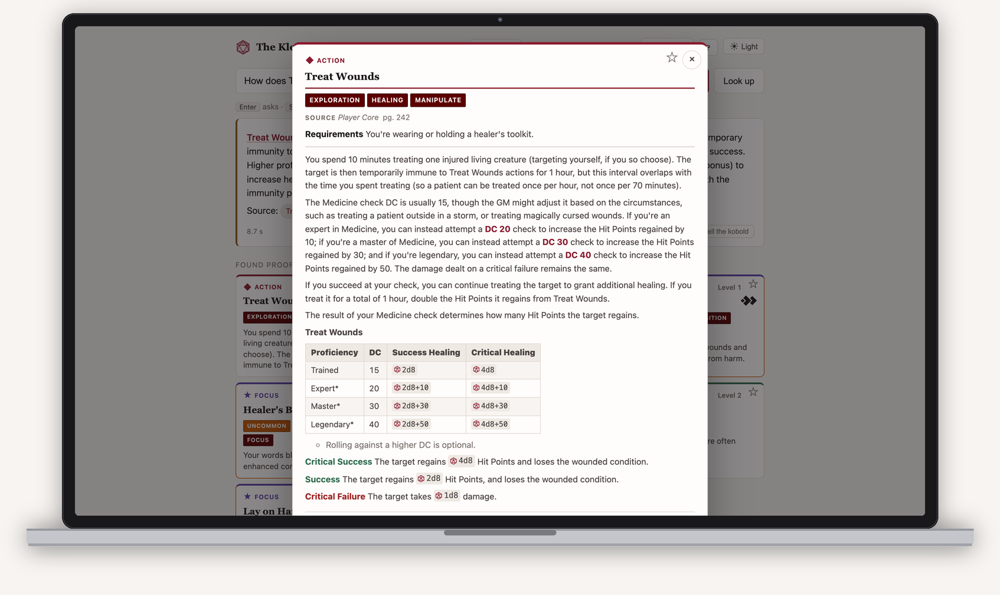
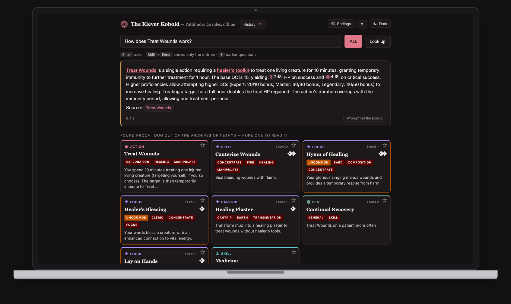

# The Klever Kobold

**A Pathfinder 2e rules reference that runs on your own computer, cites every
answer, and is wrong just often enough to keep you honest.**

Ask "How does Treat Wounds work?" and get a short answer with the Archives of
Nethys entries it was read from, right underneath, in under fifteen seconds on a
laptop. Ask "Who rules Cheliax?" and it digs through PathfinderWiki instead. No
account, no cloud, nothing you type leaves the machine.


| An entry, opened | The dark side |
| --- | --- |
|  |  |


## Get it

**macOS or Linux** — one line in a terminal:

```bash
curl -fsSL https://raw.githubusercontent.com/DeastinY/klever-kobold/main/deploy/install.sh | sh
```

**Windows** — one line in PowerShell:

```powershell
irm https://raw.githubusercontent.com/DeastinY/klever-kobold/main/deploy/install.ps1 | iex
```

Either installs [Ollama](https://ollama.com) and [uv](https://docs.astral.sh/uv/)
if they are missing, pulls the two models (about 4 GB), fetches the index
(270 MB: the rules and the lore), and opens the kobold in your browser. From then on it is:

```bash
kobold serve
```

Needs about 6 GB of memory and 5 GB of disk. Apple Silicon, Linux, and Windows
are all fine; a GPU helps but is not required. Details, other ways to install,
and every option are in [docs/running.md](docs/running.md).

## What it does

- **Answers from the rules, not from memory.** Every answer is written from the
  eight most relevant entries in a local copy of the Archives of Nethys, and
  those entries are shown under it, as stat blocks, linked to the site.
- **Enter asks; Shift+Enter just shows the entries**, which is faster and often
  all you need. Click an entry to read all of it.
- **Names in an answer are links.** "You can Grab an Edge as a reaction" opens
  Grab an Edge.
- **Knows Golarion too.** Setting questions are answered from a local copy of
  PathfinderWiki, cited the same way. A rules question never gets a lore
  answer: the kobold reads each question and picks the shelf, and when it is
  not sure it sticks to the rules. Settings → *What it digs through* pins it
  either way.
- **Keeps what you asked.** History and favourites live in your browser; asking
  the same thing twice is instant.
- **Can hold a conversation, if you ask it to.** Off by default; switch it on in
  Expert mode, or run `kobold chat`. Then "and what if she's prone?" is a
  question the kobold can actually look up.
- **Wrong? Report it.** One button under every answer. Reports are how the
  kobold gets less wrong; see [docs/reporting.md](docs/reporting.md) for exactly
  what is sent and what happens to it.
- **Works with Claude.** `kobold mcp` gives Claude Desktop or Claude Code the
  same search, so a stronger model can read the rules itself.
- **Bring your own model.** Any OpenAI-compatible server can do the answering;
  retrieval stays local.

## What to trust

It is a lookup tool, not a rules judge. This is measured, not modest:

| Ask it | How it does |
| --- | --- |
| "What level is Battle Medicine?" | **Reliable.** |
| "How does Treat Wounds work?" | **Reliable**, with a citation you can check. |
| "Is there a feat that makes falling less dangerous?" | **Mostly** — about three times in four. |
| **"Does X interact with Y?"** | **Do not trust it.** Find the rule here; read it yourself. |
| "Who rules Cheliax?" | **Mostly.** 47 of 50 hand-written lore questions bring up the right PathfinderWiki page; the wiki is thorough on the older books and thin on the newest. |

On 109 hand-written questions the default model gets 93 right; on questions real
tables ask, retrieval finds the answer outright only about a third of the time.
How it works, and what it took to find out, is a story for a blog post.

## Why not just ask ChatGPT?

| | The Klever Kobold | ChatGPT, Claude or Gemini |
| --- | --- | --- |
| Built for | One game and one job: find the rule, show it | Everything, so nothing in particular; it drifts from the question into what sounds right |
| Where the answer comes from | The Archives of Nethys entry, cited, right under the answer | Memory: two editions and a Remaster, blended |
| When it does not know | Says so, and shows what it found instead | Fills the gap fluently |
| Where it runs | On your machine, offline; nothing you type leaves it | A data centre, behind an account, into a log |
| What it costs | Nothing. A 4 GB model, 6 GB of memory | A subscription or a rate limit |
| What it burns | A small model on your own hardware for a few seconds | A frontier model on a rack of GPUs, per answer |
| Whose work it is | The Archives and PathfinderWiki — volunteers, credited on every answer | Scraped, uncredited |
| Who can fix it | Anyone: the code, the index, every experiment and every wrong-answer report are public | Nobody you can reach |
| Golarion lore | PathfinderWiki, cited | Plausible, uncited, sometimes from a novel |
| Rule interactions | Unreliable — **and it shows you the rule** | Unreliable, and confident |

The "drifts" row is measured, not marketing. On the same 459 lookup questions,
GPT-5 asked cold gets **28%** (GPT-4.1-mini 23%; on "what are the traits of X?",
1 in 80; GPT-4.1-mini invented an answer for 33 of 40 things that do not exist).
Given the kobold's retrieval, GPT-5 gets **88%** and a local 9B model 89.5% —
the corpus is doing the work, not the model. Claude and Gemini were not run
cold; there is no reason to expect a different shape. Full accounting in
[`notes/experiments.md`](notes/experiments.md); the runs are in `eval/runs/`.

## Documentation

- [Running it](docs/running.md) — every way to install and run, all the options, Docker, MCP.
- [Reporting wrong answers](docs/reporting.md) — what a report contains, where it goes, what it is used for.
- [Licensing](docs/LICENSING.md) — what the content licences allow, and the grey areas, named.
- [Contributing](CONTRIBUTING.md) — how to help, from a one-minute report to a pull request.

## Attribution

**This work uses trademarks and/or copyrights owned by Paizo Inc., used under
Paizo's Community Use Policy ([paizo.com/communityuse](https://paizo.com/communityuse)).
We are expressly prohibited from charging you to use or access this content.
This work is not published, endorsed, or specifically approved by Paizo. For
more information about Paizo Inc. and Paizo products, visit [paizo.com](https://paizo.com).**

The rules corpus is [Archives of Nethys](https://2e.aonprd.com/), free, complete,
and kept current through an edition remaster by a small team. Every answer here
is really theirs. **If the kobold earns its keep at your table, please
[support the Archives on Patreon](https://www.patreon.com/nethys)** — that is
what keeps the site free for everyone, this tool included. Lore comes from
[PathfinderWiki](https://pathfinderwiki.com/), written by volunteers; the way to
support a wiki is to [help write it](https://pathfinderwiki.com/wiki/Help:Contents).

Full acknowledgements, including the fonts and the models, are in
[NOTICE.md](NOTICE.md).

**Licence.** The code is [MIT](LICENSE). The game content it works with is not
ours to licence: rules text is ORC / Community Use Policy, lore is Community Use
Policy, both non-commercial. [docs/LICENSING.md](docs/LICENSING.md) has the details.

## Supporting this

The Archives come first; see above. If, after that, you want to keep the kobold
fed — the index rebuilds, the wrong-answer reports, the evenings — there is
[GitHub Sponsors](https://github.com/sponsors/DeastinY) and
[paypal.me/deastiny](https://paypal.me/deastiny). Nothing is gated behind
either, and nothing here will ever be; the licence forbids it and so would we.
