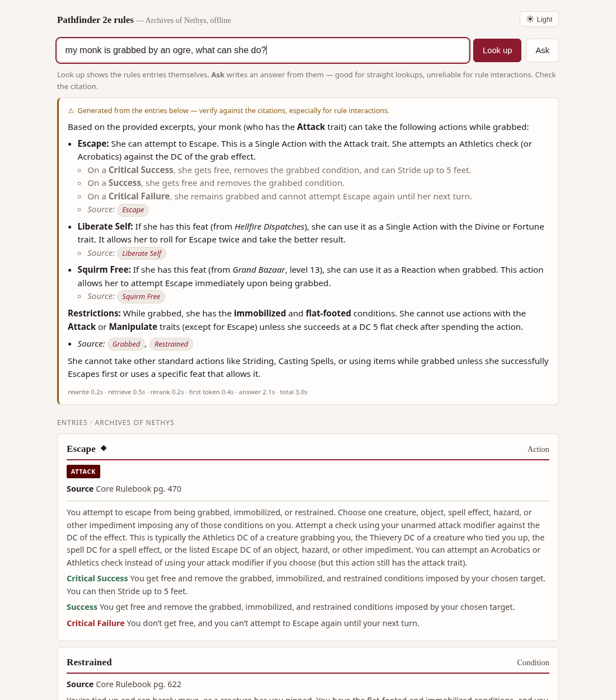
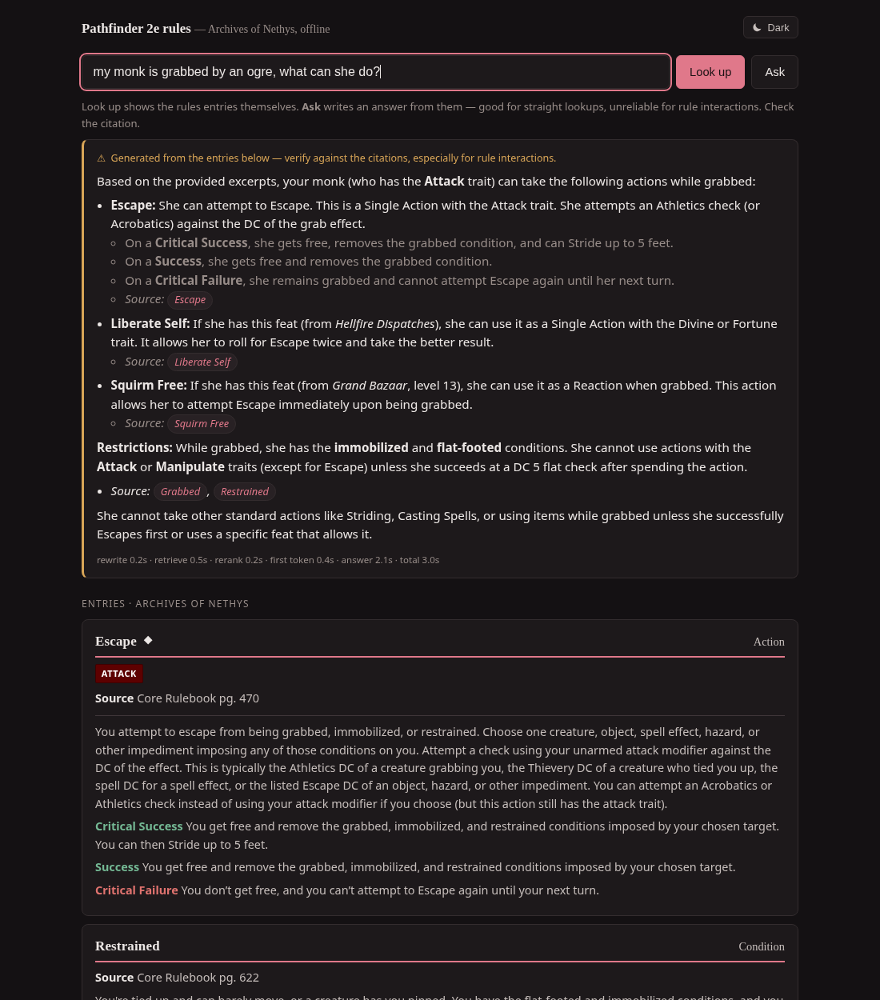
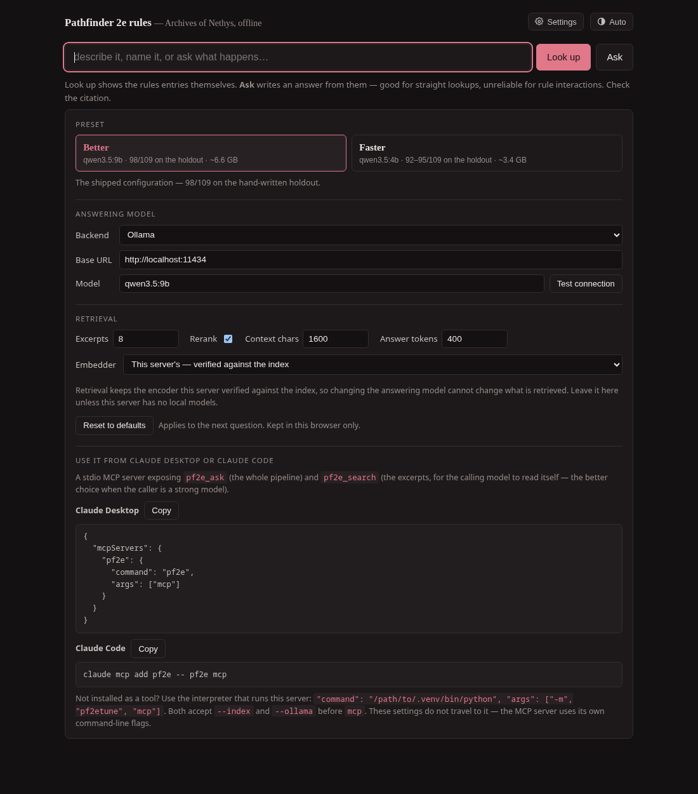

# pf2etune


-2f6b4f)


A Pathfinder 2e rules reference that runs entirely on your own machine, searches
the Archives of Nethys, and cites every answer.

**Python 3.11+.** Two models via [Ollama](https://ollama.com): `qwen3.5:9b` (Q4,
6.6 GB) answers, `qwen3-embedding:0.6b` retrieves. 7.2 GB resident, four runtime
dependencies, no torch, no network after setup.

---

## Read this before you trust it

It is a **lookup tool, not a rules adjudicator** — and that distinction is
measured, not modest.

| Ask it | How it does |
| --- | --- |
| "What level is Battle Medicine?" | **Reliable.** |
| "How does Treat Wounds work?" | **Reliable**, with a citation you can check. |
| "Is there a feat that makes falling less dangerous?" | **Mostly** — about three times in four. |
| **"Does X interact with Y?"** | **Do not trust it.** |
| "Tell me about Cheliax" | **Thin.** Lore is not indexed yet. |

A real failure, verbatim, asked whether a rogue gets sneak attack on the
*fighter's* Reactive Strike:

> **Yes, she gets Sneak Attack damage.** … a creature is flat-footed if they are
> flanked by at least two enemies and have not yet acted in the current round.

Wrong three times over: sneak attack applies to the rogue's own Strikes,
*flat-footed* is the pre-Remaster name for *off-guard*, and "denied their
Dexterity bonus" is Pathfinder 1e language. It cited two real AoN pages while
doing it.

**Interaction questions are where it fails and where a table most wants an
answer.** Use it to find the rule fast; read the rule before settling an
argument. Every answer carries its source URL so that is a one-click check —
which is why the UI labels the answer, links every claim, and keeps the rules
entries right underneath it.

**91.7%** on 109 hand-written questions — but those are lookups. On real
questions mined from RPG StackExchange, only **31.8%** of retrieved excerpt sets
are judged to contain the answer at all.

---

## Screenshots

| light | dark |
| --- | --- |
|  |  |

Entries render as stat blocks — action glyphs, trait pills, degrees of success —
and link back to AoN. Answers stream, so sources appear as soon as retrieval
finishes. Settings let you point the answering model at any OpenAI-compatible
provider, or attach the retrieval to any model over MCP:



---

## Run it

```bash
uv tool install git+ssh://git@github.com/DeastinY/pf2etune
pf2e setup --install-ollama     # installs Ollama, pulls both models, fetches the index
pf2e serve                      # http://localhost:8765
```

`pf2e setup` is idempotent. Without `--install-ollama` it prints the one command
for your platform and stops. `pf2e doctor` checks each moving part separately.

Every answer has a **Wrong? Report it** button. With `--report-url` (a free
Cloudflare Worker, see [`deploy/report-worker`](deploy/report-worker/README.md))
the report goes to your mailbox; without one it opens a pre-filled GitHub issue
or copies the report. Nothing is sent unless someone fills the form and presses Send.

The 4B answers by default: 93/109 on the holdout against the 9B's 100, at twice
the speed and half the memory, and a 16 GB laptop stays usable while it thinks.
`--llm-model qwen3.5:9b` runs the 9B; the web UI's Settings has it as the Better preset.

Also: `pf2e ask "…"`, `pf2e search "…"`, `pf2e mcp` (stdio MCP server for Claude
Desktop / Claude Code). Docker for Linux and Windows is in
[`deploy/README.md`](deploy/README.md) — on a Mac use uv, since a container
cannot reach Metal.

**Smaller machines:** `--llm-model qwen3.5:4b` halves memory to 3.4 GB and costs
seven items (93/109). Below 4B it starts answering PF2e questions with D&D 5e
rules. The UI's **Faster** preset sets this for you.

---

## How it works, and what it cost to find out

**RAG, not a fine-tune.** That was the first finding and it survived every
attempt to overturn it. A QLoRA/RAFT fine-tune scored +10.1 on the generated
benchmark and **−7.0 on hand-written questions** — better at the benchmark's
tics, worse at the job. Fine-tuning the embedder was tried twice and rejected
twice; the second attempt improved recall at every *k* while end-to-end accuracy
fell, which is the single most useful thing this project learned about metrics.

**Retrieval** is BM25 + dense over full text + dense over a summary index, fused
by reciprocal rank fusion (smoothing 5, not the TREC default 60 — swept). On top:
a rewrite step that generates the one-line summary an answering entry *would*
have and matches that against the summary index; category routing fused with the
unrouted ranking rather than replacing it; a legacy→Remaster hop; canonical
collapse before fusion; and a listwise rerank of 24 candidates down to 8 using
the answering model, so no cross-encoder and no torch. Natural-phrasing recall
went 47.2% → 76.4% R@5; situational questions 7.7% → 77.4%.

**Model choice**, all on the 109-question holdout through the deployed runtime:

| model | resident | holdout |
| --- | ---: | ---: |
| **qwen3.5:9b** *(default)* | 6.6 GB | **100/109 (91.7%)** |
| qwen3.8:27b | 17.7 GB | 98/109 (89.9%) |
| qwen3.5:4b | 3.4 GB | 93/109 (85.3%) |
| qwen3.5:2b | 2.7 GB | 86/109 (78.9%) |
| qwen3.5:0.8b | 1.0 GB | 83/109 (76.1%) |

Nothing above 9B is worth its memory — 27B is 2.8× the weights for no gain. The
ceiling is retrieval, not the answering model.

**Against frontier models**, same retrieval, on the generated benchmark:
qwen3.5:9b **89.5%**, gpt-5 **88.0%**, gpt-4.1-mini 82.4%. Closed-book, gpt-5
scores **27.9%** — the corpus is doing nearly all the work, which is the point.

The full record, including everything that failed and several measurement bugs
found in our own favour, is in [`notes/experiments.md`](notes/experiments.md).

---

## Shortcomings

- **Rule interactions are unreliable.** The headline number is lookups.
- **Lore is not indexed.** 22,604 PathfinderWiki chunks are built and unused.
- **No multi-turn.** Every question starts cold.
- **The benchmark has a noise floor of ±3 items.** One configuration run three
  times scored 95, 93, 92 — Ollama is not reproducible across processes even at
  `temperature: 0`. Differences under about four items are not results, and two
  claims in the notes were retracted for exactly this.
- **"Was Magic Missile renamed?" fails.** The legacy→Remaster hop serves Force
  Barrage correctly but drops the old name, so the model never sees the string it
  was asked about.
- **`follow_remaster` resolves hop targets under the wrong category**, so class
  feature hops fail silently. Left unfixed on purpose: the targets are class
  pages, so a working hop may be worse than the legacy row.
- **No auth on the web UI.** `--host 0.0.0.0` is for your LAN, not the internet.

## Corpus and layout

| Source | Chunks | License |
| --- | ---: | --- |
| [Archives of Nethys](https://2e.aonprd.com/) | 41,743 | ORC / Paizo CUP |
| [PathfinderWiki](https://pathfinderwiki.com/) | 22,604 *(unused)* | Paizo CUP |

Rebuilt from scratch by four scripts; nothing derived is committed. The packaged
index ships as a [release asset](https://github.com/DeastinY/pf2etune/releases).
`src/pf2etune` is the runtime, `scripts/` builds the corpus, `eval/` is the
measurement harness, `notes/` is the record.

## Contributing

[`CONTRIBUTING.md`](CONTRIBUTING.md) — mostly measurement discipline, which is the
part worth copying. The gate is 109 hand-written questions: run it before and
after, record the number when your change loses, run it more than once before
believing a small difference, and treat an implausible number as a bug until
proven otherwise. `eval/test_score.py` pins 43 grader cases; run it if you touch
the scorer.

## Attribution

**This work uses trademarks and/or copyrights owned by Paizo Inc., used under
Paizo's Community Use Policy. We are expressly prohibited from charging you to
use or access this content. This work is not published, endorsed, or specifically
approved by Paizo.**

The rules corpus is [Archives of Nethys](https://2e.aonprd.com/) — free, complete,
and maintained by volunteers through an edition remaster. Every answer here is
really theirs; please use and support the site directly. Full acknowledgements,
and exactly how each source was collected, are in [`NOTICE.md`](NOTICE.md).

## Licensing

Rules mechanics are ORC-licensed; Golarion lore and PathfinderWiki are under
Paizo's Community Use Policy — non-commercial use only. See
[`docs/LICENSING.md`](docs/LICENSING.md). This repository is for personal,
non-commercial research.
