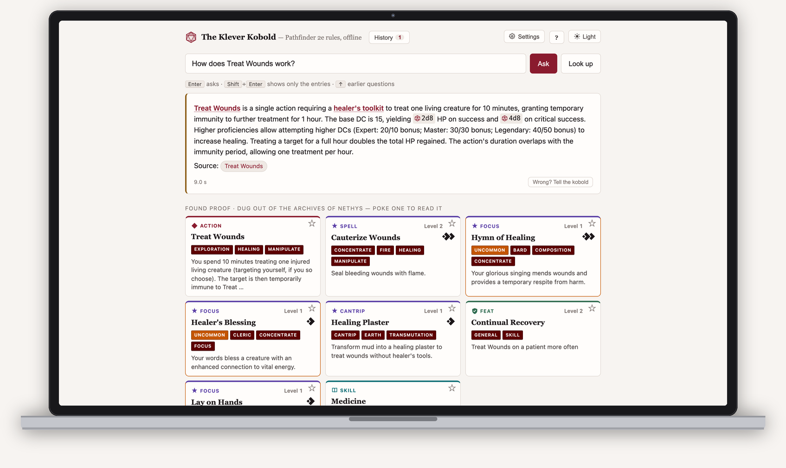

# The Klever Kobold

***Disclaimer:***
> This thing is pretty much fully vibecoded. The architecture, design, steering, and prompting are done by me. Mostly this originated from the desire to look at different techniques to fine-tune a local LLM based on the awesome Qwen3.5 line. When I realized things were working pretty well I whipped up Claude to build a small UI around it and finalize it into something usable.

**The Klever Kobold is a small LLM (Lazy-Lizard-Man) hustling locally on your computer. He often gets you better replies than big paid options as he was kept in his cave and forced to learn Pathfinder rules all day.**

Everything is fully local and offline with a small tuned model. It is based on the Archives of Nethys and PathfinderWiki.



<!-- coverage: `coverage run -a --source=src/kleverkobold eval/test_score.py eval/test_followup.py` -->


## Install

**macOS or Linux**:

```bash
curl -fsSL https://raw.githubusercontent.com/DeastinY/klever-kobold/main/deploy/install.sh | sh
```

**Windows**:

```powershell
irm https://raw.githubusercontent.com/DeastinY/klever-kobold/main/deploy/install.ps1 | iex
```

Either installs [Ollama](https://ollama.com) and [uv](https://docs.astral.sh/uv/)
if they are missing, pulls the two models (about 4 GB), fetches the index
(270 MB: the rules and the lore), and opens the kobold in your browser. From then on it is:

```bash
kobold serve
```

**With uv**, if you already have it and would rather not pipe a script into a shell:

```bash
uv tool install git+https://github.com/DeastinY/klever-kobold
kobold setup --install-ollama     # Ollama if missing, both models, the index
kobold serve                      # http://localhost:8765
```

Later, `uv tool upgrade kleverkobold` updates the program and `kobold setup`
picks up a new index; `uv tool uninstall kleverkobold` removes it.

Needs about 6 GB of memory and 5 GB of disk. Apple Silicon, Linux, and Windows
are all fine; a GPU helps but is not required. Details, other ways to install,
and every option are in [docs/running.md](docs/running.md).

## About the Kobold

- **He studied the books.** He is of course still a little stupid, but at least he will show you the pages he thinks are important to your questions.
- **Knows the rules and the lore.** Setting questions are answered from a local copy of
  PathfinderWiki. A rules question never gets a lore
  answer: the kobold reads each question and picks the shelf, and when it is
  not sure it sticks to the rules. Only want one type? There is a setting for that.
- **Remembers what you asked.** History and favourites live in your browser; asking
  the same thing twice is instant and you can collect those rulings you always forget.
- **Can hold a conversation, if you ask it to.** Off by default; switch it on in
  Expert mode, or run `kobold chat`. Then "and what if she's prone?" is a
  question the kobold can actually look up.
- **Got something wrong? Help me teach him!** Any mistakes and wrong answers can be reported back to build a community-based dataset of questions that fail. These can be used to further train later on! Check out [docs/reporting.md](docs/reporting.md) for exactly what is sent and what happens to it.
- **Works with Subscriptions too.** `kobold mcp` gives other AI agents the same search, so a stronger model can read the rules itself. Kobold would be sad though.

## Can you trust him?

No. Of course not. He is a Kobold.

| Ask him | Trust him? |
| --- | --- |
| "What level is Battle Medicine?" | **Yeah.** |
| "How does Treat Wounds work?" | **Yeah.** |
| "Is there a feat that makes falling less dangerous?" | **Maybe** — Too many options for small head. |
| **"Does X interact with Y?"** | **No.** May find the right pages, but he ain't no wizard. |
| "Who rules Cheliax?" | **Mostly.** Apparently he likes lore? |

Evaluation was pretty tight, around 95% on synthetic test data. Will report back how it plays at my table.

## Why not just ask ChatGPT/Claude/Gemini?

| | Klever Kobold | ChatGPT, Claude or Gemini |
| --- | --- | --- |
| Trained for | Pathfinder. | Everything, so knows about all RPGs and Life. |
| Where the answer comes from | Big Books (AoN & Wiki) | Memory of anything and all. |
| When it does not know | Trained to say so, but is also bad at lying. | Deception +20 |
| How much water and power it needs | Very little, fully offline and local | Let's not get into it |
| What it costs | Small, old PC/Laptop | Subscription or API calls |
| Who trains it | Well me, but also the community and maybe you! | Big Corpo. |
| Who can fix it | Anyone! It is all here. | Nobody you can reach |
| Complex Questions | Unreliable — **but he shows you the rule** | Unreliable, and confident. Will make up things |

## Documentation

- [Running it](docs/running.md) — every way to install and run, all the options, Docker, MCP.
- [Reporting wrong answers](docs/reporting.md) — what a report contains, where it goes, what it is used for.
- [Licensing](docs/LICENSING.md) — what the content licences allow, and the grey areas, named.
- [Contributing](CONTRIBUTING.md) — how to help, from a one-minute report to a pull request.

## Attribution

**This work uses trademarks and/or copyrights owned by Paizo Inc., used under
Paizo's Community Use Policy ([paizo.com/communityuse](https://paizo.com/communityuse)).
We are expressly prohibited from charging you to use or access this content.
This work is not published, endorsed, or specifically approved by Paizo. For
more information about Paizo Inc. and Paizo products, visit [paizo.com](https://paizo.com).**

The rules corpus is [Archives of Nethys](https://2e.aonprd.com/), free, complete,
and kept current through an edition remaster by a small team. Every answer here
is really theirs. **If the kobold earns its keep at your table, please
[support the Archives on Patreon](https://www.patreon.com/nethys)** — that is
what keeps the site free for everyone, this tool included. Lore comes from
[PathfinderWiki](https://pathfinderwiki.com/), written by volunteers; the way to
support a wiki is to [help write it](https://pathfinderwiki.com/wiki/Help:Contents).

Full acknowledgements, including the fonts and the models, are in
[NOTICE.md](NOTICE.md).

**Licence.** The code is [MIT](LICENSE). The game content it works with is not
ours to licence: rules text is ORC / Community Use Policy, lore is Community Use
Policy, both non-commercial. [docs/LICENSING.md](docs/LICENSING.md) has the details.

## Supporting this

The Archives come first; see above. If, after that, you want to keep the kobold
fed — there is [GitHub Sponsors](https://github.com/sponsors/DeastinY) and
[paypal.me/deastiny](https://paypal.me/deastiny). Nothing is gated behind
either, and nothing here will ever be.
